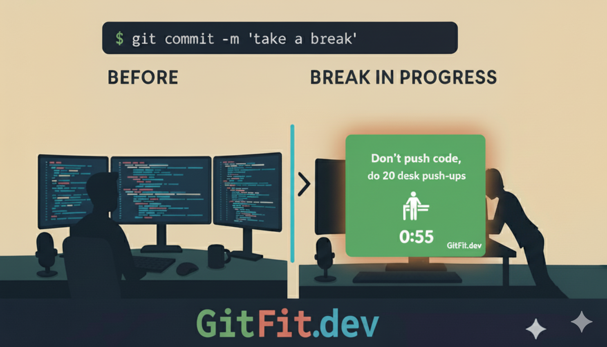

# GitFit.dev - Break Reminders That Actually Work for Developers

<div align="center">
  

  [](https://www.gnu.org/licenses/agpl-3.0)
  [](#installation)
  [](https://www.python.org/)
</div>

## 🎯 What is GitFit.dev?

GitFit.dev is a cross-platform desktop application designed specifically for developers who spend long hours coding. It displays fullscreen break reminders with fitness-themed messages at configurable intervals, helping you maintain your health and productivity.

**Key Features:**
- 🔒 **Fullscreen lock during breaks** - Cannot be dismissed until timer expires
- ⚡ **Smart scheduling** - Sub-hourly intervals with precise timing (e.g., every 30 min at :00/:30)
- 🎨 **10 beautiful themes** - Choose from green, blue, purple, dark, sunset, and more
- 🔔 **Native notifications** - Toast notifications and flash warnings before breaks
- 📅 **Active hours support** - Respects your work schedule
- 🚀 **System tray integration** - Runs quietly in the background
- 💪 **Fitness-focused messages** - Motivational break reminders with exercise suggestions

## 📸 Screenshots

<div align="center">
  
  <p><i>GitFit.dev's fullscreen break reminder in action</i></p>
</div>

## 🚀 Quick Start

### Option 1: Download Pre-built Executable
Visit [gitfit.dev](https://gitfit.dev) to download the latest installer for your platform.

### Option 2: Run from Source
```bash
# Clone the repository
git clone https://github.com/JozefJarosciak/GitFit.dev-public.git
cd GitFit.dev-public

# Install dependencies (auto-installed on first run)
pip install -r requirements.txt

# Run the application
python -m gitfitdev.app
```

## 🛠️ Installation

### System Requirements
- **Python 3.8+** (for source installation)
- **Windows 10+**, **macOS 10.14+**, or **Linux** (Ubuntu 18.04+)

### Dependencies
GitFit.dev automatically installs required dependencies on first run:
- `pystray>=0.19.5` - System tray functionality
- `Pillow>=9.0.0` - Image processing

For the PyQt5 version with extended multimedia support:
```bash
python -m gitfitdev.app_pyqt
```

## ⚙️ Configuration

GitFit.dev stores its configuration at `~/.gitfitdev/config.json`. Key settings include:

```json
{
  "interval_minutes": 30,         // Break frequency (minutes)
  "lock_seconds": 30,             // Break duration (seconds)
  "break_offset_minutes": 0,      // Offset within interval (0-59)
  "theme": "green",               // Visual theme
  "active_from": "09:00",         // Work hours start
  "active_to": "18:00",           // Work hours end
  "start_on_login": false,        // OS startup integration
  "pre_warning_enabled": true,    // Show warning before break
  "flash_duration": 3             // Flash/toast duration (seconds)
}
```

### Available Themes
- `green` (default) - Fresh and energetic
- `blue` - Calm and professional
- `purple` - Creative and inspiring
- `dark` - Easy on the eyes
- `sunset` - Warm and cozy
- `pink` - Soft and friendly
- `teal` - Modern and clean
- `indigo` - Deep and focused
- `red` - Bold and energizing
- `forest` - Natural and grounding

## 🔧 Advanced Usage

### Break Scheduling System

GitFit.dev features intelligent break scheduling:

- **Sub-hourly intervals** (≤60 min): Breaks occur at predictable times
  - 30 minutes → breaks at :00 and :30
  - 20 minutes → breaks at :00, :20, :40

- **Hourly+ intervals**: Use `break_offset_minutes` for precision timing
  - 90 minutes with 15-minute offset → breaks at :15 past every 90 minutes

### Startup Integration

Enable automatic startup through the system tray menu or configuration:

- **Windows**: Adds registry entry to `HKCU\Software\Microsoft\Windows\CurrentVersion\Run`
- **macOS**: Creates LaunchAgent plist in `~/Library/LaunchAgents/`
- **Linux**: Adds desktop file to `~/.config/autostart/`

### PyQt5 Version

For enhanced features, use the PyQt5 implementation:

```bash
python -m gitfitdev.app_pyqt
```

Features additional multimedia support and advanced overlay capabilities.

## 🏗️ Development

### Project Structure

```
gitfitdev/
├── app.py                 # Main tkinter application
├── app_pyqt.py           # Alternative PyQt5 implementation
├── config.py             # Settings management
├── themes.py             # Theme definitions
├── trigger_utils.py      # Break scheduling logic
├── toast.py              # Native notifications
├── tiny_lm.py           # Offline message generator
└── exercise_images.py    # Exercise icon generation

assets/
├── logo/                 # Application logos and icons
└── exercises/            # Exercise illustrations

.github/workflows/        # CI/CD automation
```

### Building from Source

The application supports multiple build methods:

```bash
# PyInstaller (cross-platform)
python packaging/build_pyinstaller.py

# Platform-specific builds available via GitHub Actions
```

### Running Tests

```bash
# Test overlay functionality
python test_overlay.py

# Test notifications
python test_toast.py

# Test scheduling logic
python test_trigger_times.py

# Basic import test
python -c "import gitfitdev.app; print('GitFit.dev imported successfully!')"
```

## 🤝 Contributing

We welcome contributions! Here's how to get started:

### Setting Up Development Environment

1. Fork this repository
2. Clone your fork: `git clone https://github.com/YOUR_USERNAME/GitFit.dev-public.git`
3. Install dependencies: `pip install -r requirements.txt`
4. Make your changes
5. Test thoroughly across platforms if possible
6. Submit a pull request

### Contribution Guidelines

- **Code Style**: Follow PEP 8 conventions
- **Testing**: Ensure existing tests pass and add tests for new features
- **Documentation**: Update README and docstrings for new functionality
- **Commits**: Use descriptive commit messages following conventional commits
- **Platform Support**: Consider cross-platform compatibility

### Areas for Contribution

- 🎨 New themes and visual improvements
- 🌍 Internationalization and localization
- 🏃 Additional exercise types and animations
- 🔧 Configuration UI improvements
- 📱 Mobile companion app
- 🧪 Test coverage expansion

## 📄 License

This project is licensed under the **GNU Affero General Public License v3.0 (AGPL-3.0)**.

### What this means:
- ✅ You can use, modify, and distribute this software
- ✅ You can use it for commercial purposes
- ✅ Source code must remain open source
- ⚠️ **Network use trigger**: If you run this software on a server or provide it as a web service, you must provide the source code to users
- 📝 Any derivative work must also be licensed under AGPL-3.0

### Commercial Licensing
If you need to use GitFit.dev in a proprietary application or service without AGPL-3.0 requirements, commercial licenses are available. Contact us for details.

See [LICENSE](LICENSE) for the full license text.

## 🆘 Support & Community

- 🐛 **Bug Reports**: [GitHub Issues](https://github.com/JozefJarosciak/GitFit.dev-public/issues)
- 💡 **Feature Requests**: [GitHub Discussions](https://github.com/JozefJarosciak/GitFit.dev-public/discussions)
- 🌐 **Official Website**: [gitfit.dev](https://gitfit.dev)
- 📧 **Contact**: [Contact form on website](https://gitfit.dev)

## 🙏 Acknowledgments

GitFit.dev was created with developers' health and productivity in mind. Special thanks to:

- The Python community for excellent cross-platform libraries
- Contributors who help improve the application
- Developers worldwide who prioritize their health while coding

---

<div align="center">
  <strong>Take care of your body. It's the only place you have to live. 💪</strong>

  Made with ❤️ for the developer community
</div>